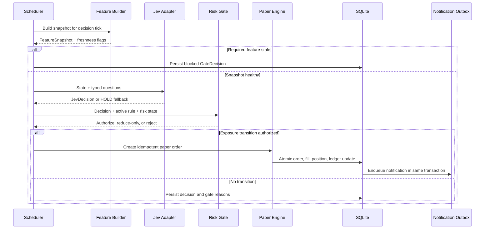

# Crypto Intraday Trading System

## Jev + Multi-Agent LLM System Design

| Metadata | Value |
|---|---|
| Status | Implementation — M1 foundation |
| Owner | Julius |
| Last updated | 2026-09-22 |
| Authors | Julius; OpenAI Codex |
| Reviewers | Risk, engineering, and operations reviewers before implementation |
| Related docs | `docs/architecture.md`, `docs/evaluation.md`, `docs/btc-paper-runbook.md` |
| Scope | Design of a standalone BTCUSDT perpetual paper-trading system; the promoted daily Donchian bot remains unchanged. |

## 1. Abstract

This document proposes a 24/7 crypto intraday paper-trading system for Binance USD-M
`BTCUSDT` perpetual futures. It combines a slow LLM analysis layer, which produces
market theses and bounded rule candidates every 60 minutes, with a fast Jev decision
layer that evaluates synchronized market features every five seconds. Jev is the
primary source of directional decisions, while deterministic code owns validation,
position sizing, margin limits, liquidation protection, idempotency, and all hard risk
controls.

The system uses isolated margin with leverage fixed at 3x, one-way positions, and at
most two entry tranches. Leverage is a buying-power ceiling, not a multiplier for the
risk budget. Each tranche risks at most 0.25% of account equity; the complete position
risks at most 0.50%, uses at most 50% notional exposure, and reserves no more than 20%
of equity as initial margin. A daily loss limit of 1.5% and a high-water-mark drawdown
kill switch of 8% remain immutable.

The first release is paper only. It has no exchange trading credentials, no endpoint
that can place a live order, and no migration path that silently converts paper orders
to live orders. A later live-trading proposal would require a separate design review,
new credentials and permissions, exchange reconciliation, and an independent launch
gate.

## 2. Goals and Non-Goals

| Goals | Non-goals |
|---|---|
| Produce a fresh, auditable Jev decision every five seconds when required inputs are healthy. | Execute real-money orders or hold an API key with trading permission. |
| Simulate perpetual-futures fills, fees, funding, margin, and liquidation risk with reproducible accounting. | Support cross margin, hedge mode, leverage above 3x, options, or spot execution. |
| Let an LLM propose declarative rules without granting it control of hard risk limits. | Let generated text or code execute directly in the trading process. |
| Promote challenger rules only after replay and a 14-day/30-trade shadow evaluation. | Optimize a challenger on the same evaluation window used to approve it. |
| Provide a private dashboard, Telegram operations channel, audit trail, and safe operator controls. | Build a public multi-user SaaS dashboard or a complex SPA. |
| Run continuously on one Linux VPS using Docker Compose and a recoverable SQLite data store. | Provide active-active availability or multi-region operation in v1. |

## 3. Background and Problem Statement

The existing repository contains a deterministic, daily BTC paper-trading campaign
based on closed candles and a promoted Donchian strategy. It is intentionally narrow,
reproducible, and conservative. An intraday system that changes rules through an LLM,
uses order-book and derivatives data, and calls a model every five seconds has a
different failure surface and must not mutate the promoted campaign or share its
paper account.

The original intraday prompt leaves several safety-critical details underspecified:

- A mutable `rules_current.json` can change behavior mid-decision and cannot provide a
  complete replay trail.
- A 30-minute champion/challenger contest measures noise rather than durable strategy
  quality.
- Repeated REST requests every five seconds produce temporally inconsistent features
  and unnecessary rate-limit pressure.
- A single confidence threshold does not protect against stale data, malformed model
  output, over-sizing, liquidation proximity, or repeated orders.
- Editing `.env` from a remote dashboard creates a secret-exposure and configuration-
  integrity risk.
- Cost assumptions are not credible until actual request counts and input tokens are
  measured. A five-second loop alone can make 17,280 Jev calls per day.

The governing invariant is therefore:

> Models may recommend exposure, but only deterministic, versioned, and replayable
> policy may authorize a paper fill.

## 4. Proposed Architecture

```mermaid
flowchart LR
    subgraph Sources[External sources]
        BWS[Binance WebSocket]
        BREST[Binance REST / CCXT]
        NEWS[RSS news]
        POSITIONING[Funding / OI / long-short / cross-venue]
    end

    subgraph Data[Market data plane]
        INGEST[Stream ingestion]
        CACHE[Timestamped cache]
        FEATURES[Feature snapshot builder]
    end

    subgraph Cold[Cold path - every 60 minutes]
        ANALYSTS[Market / News / Sentiment analysts]
        MANAGER[Research manager]
        RULEGEN[Bounded rule generator]
        VALIDATOR[Schema and risk validator]
        REPLAY[90-day replay]
        REGISTRY[Versioned rule registry]
    end

    subgraph Hot[Hot path - every 5 seconds]
        JEV[Jev decision provider]
        GATE[Deterministic risk gate]
        PAPER[Paper execution and margin engine]
    end

    subgraph Ops[Operations]
        DB[(SQLite WAL)]
        WEB[Private FastAPI dashboard]
        TG[Telegram notifier]
    end

    BWS --> INGEST
    BREST --> CACHE
    INGEST --> CACHE --> FEATURES
    NEWS --> ANALYSTS
    POSITIONING --> ANALYSTS
    FEATURES --> ANALYSTS --> MANAGER --> RULEGEN --> VALIDATOR --> REPLAY --> REGISTRY
    FEATURES --> JEV --> GATE --> PAPER
    REGISTRY --> GATE
    PAPER --> DB
    GATE --> DB
    ANALYSTS --> DB
    DB --> WEB
    DB --> TG
```



### Core components

| Component | Responsibility | Primary state | Failure behavior |
|---|---|---|---|
| Market data plane | Maintain WebSocket streams, poll slower derivatives data, calculate indicators, and emit synchronized snapshots. | In-memory cache plus persisted snapshots | Mark affected fields stale; block new entries when required fields exceed TTL. |
| LLM analysis layer | Produce evidence-backed analyst reports, a market thesis, and bounded rule candidates. | Versioned reports and candidates in SQLite | Keep the last valid thesis; do not create or activate a candidate. |
| Jev decision provider | Send one state snapshot with typed questions and normalize typed answers and confidence. | Immutable decision records | Timeout or invalid response becomes `HOLD`; no retry inside the same decision tick. |
| Deterministic risk gate | Validate freshness, rules, confidence, exposure, margin, liquidation buffer, daily loss, and drawdown. | Active rule/config versions and risk state | Fail closed for entries; risk-reducing exits remain available. |
| Paper execution engine | Simulate market fills, one-way positions, fees, funding, margin, mark-to-market, and liquidation safeguards. | Paper ledger, orders, fills, positions | Commit nothing unless order and ledger transition can be atomic. |
| Rule evaluation service | Replay candidates and run champion/challenger ledgers against identical inputs. | Candidate lifecycle and evaluation windows | Preserve champion; pause evaluation and surface missing coverage. |
| Operations plane | Serve private monitoring/control views and send deduplicated Telegram events. | Audit log and notification outbox | Trading remains safe if UI or Telegram is unavailable. |

### Deployment boundary

Docker Compose runs two application services on one Linux VPS:

- `worker`: ingestion, feature calculation, LLM schedules, Jev loop, risk gate,
  paper execution, evaluations, and notification outbox.
- `web`: read APIs, server-rendered dashboard, and narrowly scoped operator commands.

Both services mount one persistent volume. SQLite runs in WAL mode; the worker is the
single writer for trading state. The web process submits control commands into an
inbox table rather than mutating positions or rules directly. Nightly backups copy a
consistent SQLite snapshot to storage outside the container volume.

### Cross-venue market evidence

Binance remains the reference and simulated execution venue. Hyperliquid is an optional
evidence source: BTC L2 book arrives over WebSocket while funding, open interest, mark,
and oracle context refresh over public REST every 30 seconds. The worker normalizes
funding to basis points per hour, open interest to USD, and book depth/imbalance inside
5/10/25 bps bands before binding the evidence into the immutable five-second snapshot.

The overlay defaults to `shadow`. Confirming evidence may recommend `+0.5` entry quality;
conflicting evidence recommends `-1.0` and a 0.5 notional multiplier; verified venue
stress recommends no new exposure. It never changes direction, confidence, leverage,
stop-loss, or any hard-risk limit. Missing Hyperliquid evidence is neutral and leaves
Binance sizing unchanged. Activation requires a persisted 14-day promotion evaluation;
changing configuration alone cannot bypass the gate. Lighter is deferred until the
Hyperliquid pipeline completes its promotion evaluation and will reuse the same venue
frame interface.

### News-source policy

The allowlist is verified independently of model prompts. V1 enables the public RSS
feeds from the SEC, CFTC, Federal Reserve, CoinDesk, Decrypt, and Cointelegraph.
Binance announcements remain disabled until a separate signed, read-only announcement
credential is approved. The Block is not sent to an LLM because its current terms
prohibit automated AI/ML processing of its content. Wu Blockchain remains disabled
until a stable, authorized machine-readable endpoint is verified. Disabled sources
remain visible in the source catalog with a reason; the system never silently replaces
them with scraping or an unofficial mirror.

## 5. Decision and Analysis Lifecycles

### Five-second decision lifecycle



1. The scheduler creates `decision_tick_id` from the UTC five-second bucket and symbol.
2. The feature builder reads the latest stream state, closed 1h indicators, funding,
   open interest, long/short ratio, and cached positioning sentiment. It persists the
   exact input.
3. Required features must meet per-field TTLs. A stale required field produces a
   persisted blocked decision without calling Jev.
4. The Jev adapter calls OpenRouter Decisions at
   `https://openrouter.ai/api/alpha/decisions` with pinned model
   `typesafe/jev-1.13`. It records latency, token usage, provider request ID, model ID,
   and request/response hashes; raw prompts and responses are not persisted.
5. The gate maps the response to a target exposure and evaluates it against the active
   immutable rule version and current hard-risk state.
6. An authorized exposure transition becomes one idempotent simulated market order.
   Order, fill, ledger, position, audit event, and notification-outbox row commit in a
   single transaction.
7. A notification worker sends outbox events and records delivery separately. Delivery
   failure never rolls back a fill.

### Direction-to-exposure mapping

| Jev direction | Flat account | Existing same-direction position | Existing opposite position |
|---|---|---|---|
| `Strong Buy` | Target +2 long tranches | Add up to +2 | Close short; do not open long in the same tick |
| `Buy` | Target +1 long tranche | Add up to +1 | Close short; do not open long in the same tick |
| `Hold` | Stay flat | Keep current exposure | Keep current exposure |
| `Take Profit` | No-op | Reduce one tranche only when unrealized P&L is positive | Reduce one tranche only when profitable |
| `Sell` | Target -1 short tranche | Add up to -1 | Close long; do not open short in the same tick |
| `Strong Sell` | Target -2 short tranches | Add up to -2 | Close long; do not open short in the same tick |

Entry transitions have a 60-second cooldown. Closing, stop-loss, liquidation protection,
daily stop, and kill-switch actions bypass the cooldown and are always reduce-only.

### Hourly analysis and rule lifecycle

1. Market, news, and sentiment analysts independently create schema-valid reports with
   cited evidence, source times, and explicit missing-data fields.
2. The research manager consumes only those structured reports and produces a market
   thesis: bias, regimes, levels, risks, time horizon, evidence IDs, and uncertainty.
3. The rule generator may create a candidate only when the thesis materially changes
   and the 24-hour proposal cooldown has expired.
4. External content remains quoted data, never system instructions. The generated
   candidate is declarative JSON and cannot contain expressions, code, URLs, tools, or
   unknown keys.
5. The validator checks schema, allowlists, numeric bounds, and the immutable hard-risk
   envelope. Invalid candidates are rejected with structured reasons.
6. A valid candidate runs against the trailing 90 days with chronological inputs,
   closed-candle indicators, fees, funding, spread, and slippage.
7. At most one replay-passed challenger runs against the champion. Both receive the
   same snapshots but use independent ledgers and identical starting equity.
8. Evaluation lasts at least 14 calendar days and 30 closed challenger trades. New
   proposals queue without replacing the active challenger.
9. Promotion is an atomic registry transition. The former champion becomes the
   immediate rollback target. Rejected candidates enter the evaluation archive;
   promoted versions enter the hall of fame.

### Promotion formula

For a common evaluation interval:

```text
risk_adjusted_score = net_return_pct / max(max_drawdown_pct, 0.5)
```

A challenger is eligible only when all conditions hold:

- Net return after fees, funding, and slippage is positive.
- Required-data coverage is at least 99%.
- Account drawdown stays below 8% and no hard-risk invariant is violated.
- When champion score is positive, challenger score is at least 10% higher.
- When champion score is zero or negative, challenger score is greater than 0.25.

Promotion is deferred—not failed—when either the duration or trade-count requirement
has not been met.

## 6. API and Data Contracts

All persisted contracts carry `schema_version`, a stable identifier, UTC timestamps,
and provenance. Pydantic rejects unknown fields at model boundaries.

### Core contracts

| Contract | Required fields | Purpose and guarantees |
|---|---|---|
| `FeatureSnapshot` | `snapshot_id`, `symbol`, `event_time`, `built_at`, `features`, `freshness`, `quality`, `checksum` | Exact Jev/LLM input; immutable and content-addressed for replay. |
| `AnalystReport` | `report_id`, `kind`, `as_of`, `evidence[]`, `findings`, `uncertainty`, `model_ref`, `prompt_version` | Structured analyst output; external evidence remains data. |
| `MarketThesis` | `thesis_id`, `bias`, `regime`, `levels`, `risks`, `horizon`, `evidence_ids[]` | Research manager synthesis; never authorizes a trade. |
| `RuleCandidate` | `rule_id`, `parent_rule_id`, `thesis_id`, `parameters`, `constraints`, `content_hash` | Declarative proposal validated against an allowlist and hard bounds. |
| `JevDecision` | `decision_id`, `tick_id`, `snapshot_id`, `direction`, `direction_confidence`, `regime`, `toxic_flow`, `entry_quality`, `risk_level`, `model_ref` | Typed decision and the probability/score used by the gate. |
| `GateDecision` | `gate_id`, `decision_id`, `rule_id`, `risk_state_id`, `outcome`, `reason_codes[]`, `target_exposure` | Authoritative record of why exposure was authorized or rejected. |
| `PaperOrder` | `order_id`, `idempotency_key`, `side`, `quantity`, `reduce_only`, `created_at` | Requested simulated market transition; no live-exchange fields. |
| `PaperFill` | `fill_id`, `order_id`, `price`, `quantity`, `fee`, `slippage`, `filled_at` | Immutable execution fact used by the ledger. |
| `PositionSnapshot` | `side`, `quantity`, `entry_price`, `mark_price`, `notional`, `leverage`, `isolated_margin`, `maintenance_margin`, `liquidation_price`, `liquidation_buffer`, `funding`, `unrealized_pnl` | Complete one-way perpetual position state. |
| `RiskState` | `equity`, `high_water_mark`, `daily_pnl`, `drawdown`, `position_risk`, `margin_used`, `halt_state` | Source of truth for deterministic authorization. |
| `PromotionEvaluation` | `candidate_id`, `champion_id`, `window`, `coverage`, `trades`, `net_returns`, `drawdowns`, `scores`, `status`, `reasons[]` | Reproducible promotion evidence. |

### Jev question contract

- `direction`: Choice of `Strong Buy`, `Buy`, `Hold`, `Take Profit`, `Sell`, or
  `Strong Sell`.
- `regime`: Choice of `Trending Up`, `Trending Down`, `Sideways`, or `Volatile`.
- `toxic_flow`: Noul probability that current microstructure indicates manipulative or
  adverse large-order flow.
- `entry_quality`: Score from 1 to 5 using a fixed legend.
- `risk_level`: Score with fixed labels `Low`, `Medium`, `High`, and `Critical`.

`direction_confidence` is the returned probability for the selected direction, not an
average across questions. Until local calibration tests establish otherwise,
`toxic_flow` is treated as a model score with a probability-shaped range rather than
as a statistically proven market probability.

### Gate order

The gate evaluates checks in this order and persists every failed reason:

1. Global and daily halt state.
2. Snapshot integrity, required fields, and freshness.
3. Model response validity and pinned version.
4. Direction confidence at least 0.85.
5. Entry quality at least 3.
6. Toxic-flow score at most 0.30.
7. Risk level Low or Medium for new exposure.
8. Active rule allowlists and session/regime filters.
9. Entry cooldown and idempotency.
10. Position, notional, margin, stop risk, and liquidation-buffer limits.

Risk-reducing actions skip entry-only checks but must remain reduce-only and valid for
the current position.

### Hard-risk policy

```env
MARGIN_MODE=isolated
LEVERAGE=3
MAX_TRANCHES=2
MAX_TRANCHE_RISK_PCT=0.0025
MAX_POSITION_RISK_PCT=0.005
MAX_TRANCHE_NOTIONAL_PCT=0.25
MAX_POSITION_NOTIONAL_PCT=0.50
MAX_INITIAL_MARGIN_PCT=0.20
DAILY_LOSS_LIMIT_PCT=0.015
MAX_DRAWDOWN_PCT=0.08
MIN_STOP_DISTANCE_PCT=0.0075
MAX_STOP_DISTANCE_PCT=0.03
MIN_LIQUIDATION_BUFFER_PCT=0.15
EMERGENCY_LIQUIDATION_BUFFER_PCT=0.10
ENTRY_COOLDOWN_SECONDS=60
```

These values belong to a versioned deployment policy. The dashboard, LLM, Jev, rule
candidates, and runtime `.env` editor cannot change them.

### Position sizing

For each tranche:

```text
risk_limited_notional = (equity * 0.0025) / stop_distance_pct
tranche_notional = min(equity * 0.25, risk_limited_notional)
position_notional = min(sum(tranches), equity * 0.50)
initial_margin = position_notional / 3
```

The gate rejects quantities below Binance symbol minimums after tick/step-size
rounding. It also rejects additions that would make initial margin exceed 20% of
equity. Liquidation price uses the current Binance maintenance-margin tier and mark
price, not a fixed percentage approximation.

### Dashboard interface

Read endpoints expose status, snapshots, decisions, gate reasons, paper positions,
ledger, rules, reports, evaluations, costs, and service health. The only mutation
commands are:

- Pause new entries.
- Resume entries after an explicit confirmation.
- Flatten the paper position with a reduce-only command.
- Roll back to the immediately preceding champion.
- Enable or disable non-critical Telegram notifications.
- Test, activate, or deactivate redacted model-provider profiles through the worker
  command queue. Provider secrets remain CLI-only.

Commands use an explicit Bearer control token rather than cookie authentication, require
idempotency keys for provider mutations, and are appended to the audit log. The dashboard
never mounts, reads, or writes secret values.

## 7. Consistency, Idempotency, and Replay

| Scenario | Expected behavior | Mechanism |
|---|---|---|
| The same five-second tick runs twice | At most one order/fill transition exists; both attempts resolve to the same decision record. | Unique `decision_tick_id` and order idempotency key. |
| Jev times out or returns invalid data | Persist a `HOLD` fallback and provider error; do not retry within the tick. | Bounded timeout and strict response validation. |
| SQLite transaction fails | No partial order, fill, position, ledger, or outbox state is visible. | One atomic transaction with rollback. |
| Telegram send fails | Trading record remains committed; notification retries with backoff and deduplication. | Transactional outbox and delivery key. |
| Configuration changes during a decision | The versions captured when the decision started remain authoritative. | Immutable config/rule IDs on every decision. |
| Worker restarts with an open position | Rebuild state from ledger, verify the latest position snapshot, then resume decision ticks. | Event/ledger reconciliation before scheduler readiness. |
| Market stream reconnects | New entries remain blocked until snapshots are fresh and sequence gaps are resolved. | Stream sequence tracking and readiness gate. |
| Replay is requested | Reuse stored snapshots, rule/config versions, model outputs, and execution assumptions. | Immutable provenance and content hashes. |

Internal times are UTC. Event time determines market ordering; receive time measures
latency. The system never silently substitutes receive time for a missing event time.

## 8. Security and Privacy Considerations

- The VPS exposes no public dashboard port. Operators connect through an SSH tunnel or
  private VPN; FastAPI binds to localhost by default.
- API credentials live in an owner-readable `0600` secrets file, outside
  the repository and database. Logs redact authorization headers and secret-shaped
  fields.
- V1 does not store a Binance trading key. Public market-data access is sufficient for
  the paper venue.
- RSS titles/summaries and all external text are untrusted data. They are length-limited,
  tagged by source, passed only in data fields, and prevented from selecting tools,
  schemas, models, URLs, or system prompts.
- Generated rules use strict JSON schemas with unknown fields forbidden. No expression
  evaluation, dynamic imports, subprocesses, or generated Python are supported.
- Operator commands use explicit Bearer authentication, idempotency, confirmation for
  flatten/rollback, and immutable audit records. Cookie sessions are not used.
- Raw news content has a 30-day retention default; normalized evidence and
  hashes are retained with the evaluation record. Trading/audit records are retained
  for the entire paper campaign.
- Backups are encrypted in transit and at rest, tested monthly, and never include
  environment-secret files.

## 9. Operational Readiness

| Signal | SLO or alert | Launch gate |
|---|---|---|
| Decision-loop availability | At least 99% of scheduled ticks finish with a persisted decision or explicit blocked reason over 24 hours. | Required |
| Snapshot freshness | At least 99% required-data coverage; alert after 60 seconds of continuous staleness. | Required |
| Decision latency | p95 under 3 seconds and always below the five-second decision budget; timeout becomes `HOLD`. | Required |
| Duplicate execution | Zero duplicate fills for one idempotency key. | Required |
| Ledger integrity | Equity, fills, funding, fees, and position reconcile on every restart and nightly. | Required |
| Risk-policy drift | Runtime hard-risk hash must equal deployment manifest; any mismatch halts new entries. | Required |
| Drawdown/liquidation safety | 8% drawdown and 10% emergency liquidation-buffer paths flatten and halt in fault-injection tests. | Required |
| Notifications | Critical alerts delivered or visibly queued; duplicates suppressed. | Recommended |
| Cost telemetry | 100% model calls record model, latency, token usage, and estimated cost. | Required |

### Health and recovery

- Docker health checks cover scheduler progress, stream freshness, database writes,
  provider reachability, and outbox backlog.
- The worker restarts automatically but becomes ready only after ledger reconciliation
  and a healthy feature snapshot.
- A nightly consistent SQLite backup is copied off-volume; seven daily and four weekly
  copies are retained.
- Telegram sends executed fills, promotion/rollback, kill-switch, sustained dependency
  incidents, and a daily summary at 09:00 `Asia/Ho_Chi_Minh`. Raw five-second signals
  are visible in the dashboard but are not individually pushed.
- Model spend is measured rather than assumed. The dashboard reports requests, tokens,
  latency, errors, and estimated daily cost per model/provider.

### Verification and launch gates

Before a paper campaign starts, automated tests must cover:

- Closed-candle indicators and no-look-ahead replay.
- Feature synchronization, staleness, stream gaps, and REST rate limits.
- Valid, low-confidence, malformed, timed-out, and version-mismatched Jev responses.
- Position sizing under rounding, minimum quantity, two tranches, and both directions.
- Fees, funding, slippage, mark-to-market, maintenance margin, and liquidation price.
- Daily stop, drawdown kill-switch, liquidation-buffer reduction, and manual reset.
- Worker restart, database rollback, duplicate ticks, outbox retry, and rule promotion.
- Hyperliquid reconnect, frame checksums, cross-venue normalization, shadow isolation,
  and baseline-vs-overlay replay using identical decisions.
- Prompt-injection attempts in every external-text field.
- Dashboard secret redaction, Bearer authorization, idempotency, and command auditing.

The final pre-campaign gate is a 72-hour soak with zero duplicate fills, zero ledger
reconciliation errors, no lost decision events, and successful fault injection for
data/provider outages.

## 10. Alternatives Considered

| Alternative | Why considered | Why not selected |
|---|---|---|
| Let LLM update `rules_current.json` directly | Fast adaptation and minimal implementation. | Breaks replay, allows mid-tick changes, and grants unvalidated text authority over trading behavior. |
| Select challenger after 30 minutes | Quick feedback. | Too few independent trades and too sensitive to one short market regime. |
| Poll every source through REST every five seconds | Simple implementation through one CCXT interface. | Produces mismatched timestamps, higher latency, and avoidable rate-limit pressure. |
| Use Jev only as advisory telemetry | Lowest model risk. | Does not test the intended product hypothesis that a typed System One model can own directional decisions inside deterministic safeguards. |
| Give Jev direct execution authority | Short hot path. | Model/provider errors could bypass risk, sizing, idempotency, and liquidation controls. |
| Use spot BTC/USDT | Simpler accounting and no liquidation. | Cannot faithfully exercise symmetric long/short intraday decisions or funding-related signals. |
| Use cross margin or hedge mode | More capital flexibility. | Enlarges blast radius and complicates attribution; isolated one-way state is safer and easier to replay. |
| Use PostgreSQL immediately | Strong multi-writer concurrency and mature operations. | A single-host, single-writer paper system does not yet justify the operational cost; contracts keep a future migration possible. |

## 11. Open Validation Questions

No question blocks implementation of the paper design. The following hypotheses must
be measured and must not be converted into assumptions:

1. Whether Jev direction confidence and toxic-flow scores are calibrated for this
   market domain. Store enough outcomes to create reliability diagrams by regime.
2. Whether five-second decisions improve net results after spread, slippage, funding,
   and churn compared with slower baselines.
3. Actual daily Jev and LLM cost using observed input sizes and call frequency.
4. Availability and quality of optional Coinglass/X feeds. The system must remain valid
   when both are disabled.

## 12. Decision and Next Steps

The recommended decision is to build this as a standalone, paper-only research system
with Jev as the directional decision source and a deterministic risk kernel as the
final authority. Isolated leverage is fixed at 3x, but the position is capped at 50%
notional, 20% initial margin, and 0.50% total stop risk. The current Donchian campaign
and its data, account, scheduler, and promotion status remain untouched.

| Milestone | Deliverable | Exit criteria |
|---|---|---|
| M1 — Deterministic foundation | Market-data recorder, synchronized snapshots, paper perpetual ledger, margin/risk engine, and replay fixtures. | Ledger reconciles; sizing and all kill switches pass unit/property tests without any model dependency. |
| M1.1 — Cross-venue shadow | Hyperliquid hybrid collector, normalized venue frames, shadow overlay, dashboard health, paired replay, and immutable promotion gate. | 14 days, ≥95% coverage, ≥100 non-Hold decisions, ≥30 closed trades, and non-inferior risk metrics. |
| M2 — Jev shadow decisions | OpenRouter adapter, typed decisions, gate records, cost telemetry, and dashboard views; no paper fills initially. | 72-hour decision soak meets freshness, latency, idempotency, and fail-closed gates. |
| M3 — Paper execution | Authorized simulated fills, Telegram operations, one champion, and one challenger ledger. | 30 days without duplicate fills or reconciliation errors; risk interventions verified. |
| M4 — Adaptive rules | Hourly analysis, bounded candidates, 90-day replay, 14-day/30-trade evaluation, atomic promotion and rollback. | At least one full challenger evaluation is reproducible from stored inputs and passes promotion-policy tests. |

Any proposal for live trading starts a separate architecture and security review. Paper
performance alone is not approval to add exchange trading permissions.

## References

- [TypeSafe System One concepts](https://docs.typesafe.ai/concepts/system-one)
- [OpenRouter TypeSafe/Jev models](https://openrouter.ai/typesafe)
- [OpenRouter API quickstart](https://openrouter.ai/docs/quickstart)
- [CCXT manual](https://github.com/ccxt/ccxt/wiki/Manual)
- [Binance derivatives API catalog](https://developers.binance.com/en/docs/catalog)
